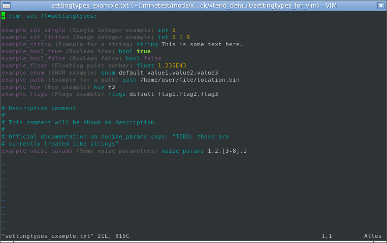
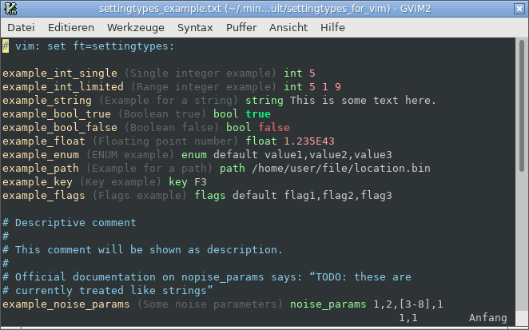

This Vim syntax highlighting file can be used for highlighting the Minetest `settingtypes.txt` files.

The highlighting works in both shell and GUI and uses the generic groups only so it adapts to all themes that style those groups.

You install the file by copying or symlinking it to `~/.vim/syntax` and then either use the Vim modeline as shown in the examples or by adding/extending the `augroup filetypedetect` in your `~/.vim/filetype.vim`.

    augroup filetypedetect
    [more content]
    autocmd BufNewFile,BufRead settingtypes.txt setf settingtypes
    augroup END

Now when you open a file named `settingtypes.txt` Vim wil automatically use the settingtypes syntax highlighting.
